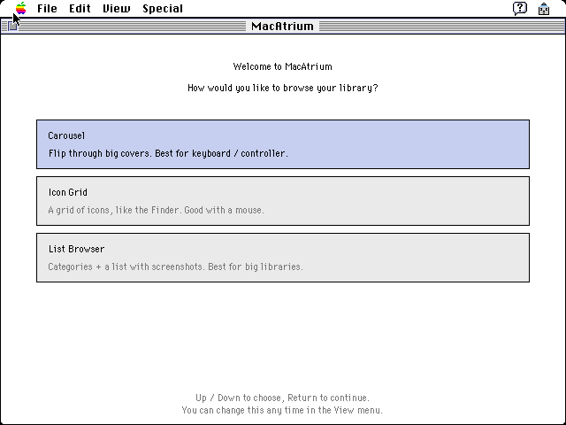
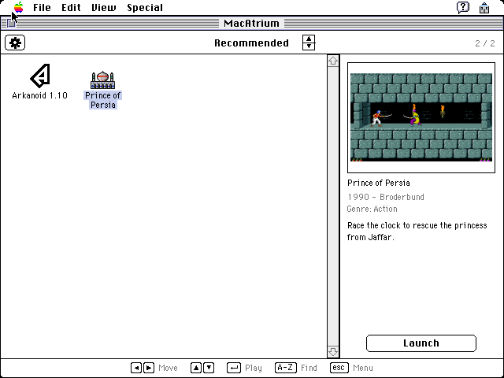
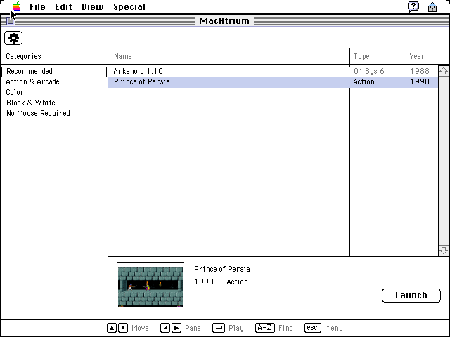
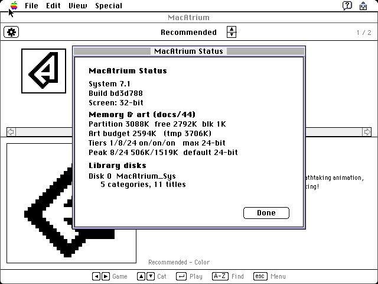

# MacAtrium

**A keyboard-driven game & software launcher that boots in place of the Finder
and turns a vintage Mac into an appliance.** Power on, land in a clean library of
classic Mac games and apps, pick one with the arrow keys, hit Return, play, quit —
and you're right back in the menu. The model is the **AmigaVision** boot shell: a
fast, legible, controller-friendly front end that hides the file system behind a
curated, categorized library.

It targets real 68k hardware and **MiSTer FPGA** cores (Mac Plus, Mac LC, Mac II)
alike, so it has to feel good with a gamepad → key mapping, not just a mouse. **One
68k binary** spans System 6.0.8 through 7.5.5 and black-and-white through 24-bit
colour, detecting the machine at boot and coming up at the deepest screen depth the
display card supports.


---

## Three ways to browse

On first run MacAtrium asks how you'd like to browse; the **View** menu switches at
any time. All three share the same paged catalog, deferred cover art, and controls.



| | |
|---|---|
|  |  |
| **Carousel** — a 5-up cover flow with a large detail pane. Best for a keyboard or controller. *(dark theme shown.)* | **Icon Grid** — a Finder-style grid of covers with a live detail panel. Best with a mouse. |
|  |  |
| **List Browser** — a categories pane plus a sortable list with a screenshot strip. Best for big libraries. | **MacAtrium Status** — the memory & art capability set the launcher computed at boot. |

---

## Adapts to the machine

MacAtrium sizes itself to whatever it wakes up on. Crucially, **screen depth and
art depth are separate axes**:

- **Screen** comes up at the **deepest depth the display card can show** — 24-bit
  "Millions" on an 8•24 card, 256 colours on an 8-bit card, 1-bit on a compact.
- **Art** is baked at 1-, 8-, and 24-bit, and the launcher loads the deepest
  variant the **memory partition can hold**, checking each cover's size up front and
  **degrading a tier (24 → 8 → 1) instead of running out of memory**. A deep screen
  on a small partition keeps the deep screen and simply shows shallower art.
- **MacAtrium Status** (in the menu) reports the partition it was granted, the art
  budget, and which tiers this machine can both display and hold.

---

## One disk, many systems

A single disk can carry several System Folders — for example **6.0.8, 7.1 and
7.5.5** — with MacAtrium installed into every one (a Startup Item under 7.x, the
Finder itself on 6.0.x). The built-in **System Folder Chooser** blesses a different
System and asks you to shut down cleanly — the 68k cores can't reboot in place — so
the next power-on lands in the OS you chose, still inside MacAtrium.

---

## Controls

Everything is driven by a tiny key set so a MiSTer joystick → key mapping covers
it. The mouse works but is never required.

| Key | Action |
|---|---|
| `←` `→` | Move between titles |
| `↑` `↓` | Change category |
| `Return` | Launch the selected title |
| `I` | More info (year, developer, genre, description) |
| `P` | Box art, full-screen |
| `Esc` | Menu — Settings, MacAtrium Status, System Folder Chooser, return to Finder, Shut Down |

The detail pane shows a **screenshot** as the primary cover; box art is one `P`
keypress away. Settings cover the browse view, colour depth, artwork preference,
theme, text size, sound, and a "safe mode" that disables launching for browsing.

---

## How it works

- **Boots as the Finder.** On System 6 the launcher replaces the Finder file; on
  7.x it installs as a Startup Item under MultiFinder. The user never has to see
  the desktop.
- **Paged, curated catalog.** The library is a generated catalog, not the file
  system. Titles are grouped into categories (Recommended is the default landing
  view); each category is paged and loaded on demand, so a library of well over a
  thousand titles stays within a compact Mac's memory.
- **Adaptive display & art.** The launcher detects the card's depths at boot, comes
  up at the deepest, and picks the art tier the partition can hold — never OOMing on
  a cover it can't fit.
- **One 68k binary** spans System 6.0.8 through 7.5.5 and B&W through 24-bit colour.


---

## The editions

One launcher binary; ready-to-run disk images tuned to the machine. Each carries the
full installable library (apps are ~95% of every disk); they differ only in art
depth and the launcher's memory partition. A single **multi-system** disk can also
carry several of these System Folders at once (see above).

| Edition | Machine / OS | Art | Verified on |
|---|---|---|---|
| **B&W** | Mac Plus/SE/Classic · System 6.0.8 | 1-bit | Snow (Mac II) |
| **Colour** | Mac LC/II · System 7.1 | 1-bit + 8-bit (256) | Snow + MDC |
| **Quadra / full** | Quadra 800 (68040) · System 7.5.5 | 1-bit + 8-bit + 24-bit "Millions" | QEMU Quadra 800 |

| | |
|---|---|
|  |  |
| **Launch & return** — hit Return to run the app; quit and you're back at the exact spot you left. | **B&W edition** — the same single 68k binary, adapted to 1-bit on a System 6.0.8 compact Mac. |

---

## Building

Disk images are assembled by the **`atrium`** tool (Rust, in `tools/atrium-tool/`)
on top of **[rusty-backup](https://github.com/danifunker/rusty-backup)**'s `rb-cli`
for HFS volume I/O. The 68k launcher itself is built with
**[Retro68](https://github.com/autc04/Retro68)**.

```sh
# 1. Build the 68k launcher with Retro68 -> build/MacAtrium.bin.
#    (Build/install the Retro68 toolchain first, then point CMake at its toolchain.)
export RETRO68=/path/to/Retro68-build
cmake -S . -B build \
  -DCMAKE_TOOLCHAIN_FILE=$RETRO68/toolchain/m68k-apple-macos/cmake/retro68.toolchain.cmake
cmake --build build

# 2. Build the atrium image tool (reads the launcher from build/MacAtrium.bin).
cargo build --release --manifest-path tools/atrium-tool/Cargo.toml

# 3. Assemble a disk image from a build config. Start from builds/example.json;
#    rb-cli (from rusty-backup) must be on your PATH.
./tools/atrium-tool/target/release/atrium image --config builds/example.json
```

A build harvests apps from donor disks, enriches metadata + art from the
**Macintosh Garden** archive, bakes the catalog, and injects everything into a
bootable HFS image. `atrium install-all-systems` adds the launcher to every System
Folder of an existing multi-system disk. See `docs/` for the full architecture and
design notes.

---

## Status

**Beta.** The editions build clean, the Quadra edition is emulator-verified
end-to-end, and the memory/art adaptation is validated across partition sizes in
Snow. The front end is functional and under active polish. Curation of the
Recommended list draws on community favourites from the vintage-Mac forums.

Recommendations are curated at build time — contributions to the library and the
recommendations list are welcome.

## Credits

- **[rusty-backup](https://github.com/danifunker/rusty-backup)** — `rb-cli`, the HFS/disk-image engine.
- **[Retro68](https://github.com/autc04/Retro68)** — the 68k Mac cross-compiler.
- **[Snow](https://github.com/twvd/snow)** and **QEMU** — headless emulation for verification.
- **The Macintosh Garden** — artwork and metadata for the library.

## License

MacAtrium's source code is **MIT**-licensed — see [LICENSE](LICENSE). The bundled
library data derives from the **Macintosh Garden** and is included for
preservation; see [NOTICE.md](NOTICE.md). MacAtrium ships **no** Apple ROMs, system
software, or game binaries — you supply those yourself.

Contributions to the code, the library, and the Recommended list are welcome —
see [CONTRIBUTING.md](CONTRIBUTING.md).
