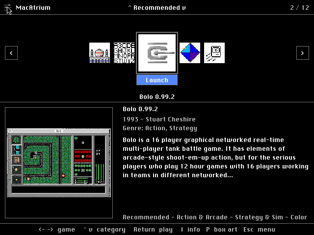
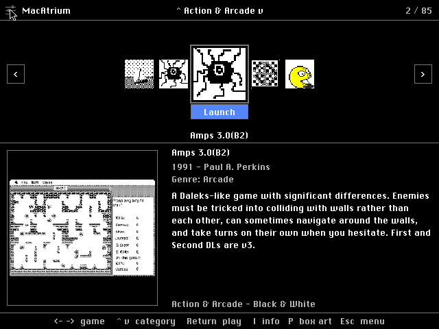
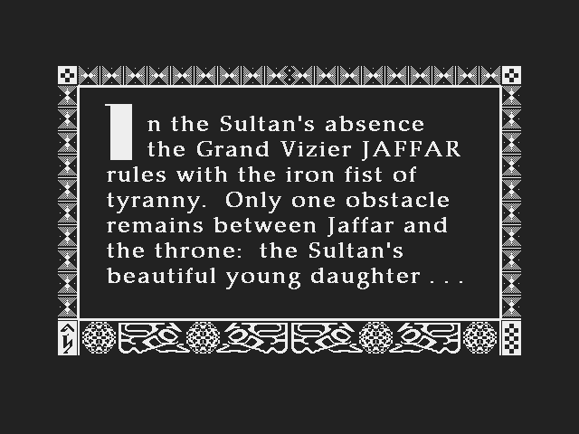
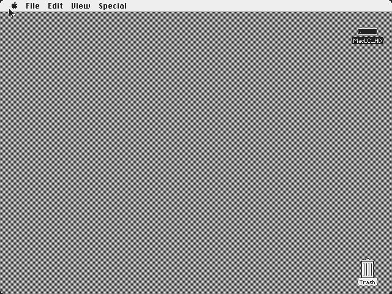

# MacAtrium

**A keyboard-driven game & software launcher that boots in place of the Finder
and turns a vintage Mac into an appliance.** Power on, land in a clean carousel of
classic Mac games and apps, pick one with the arrow keys, hit Return, play, quit —
and you're right back in the menu. The model is the **AmigaVision** boot shell: a
fast, legible, controller-friendly front end that hides the file system behind a
curated, categorized library.

It targets real 68k hardware and **MiSTer FPGA** cores (Mac Plus, Mac LC, Mac II)
alike, so it has to feel good with a gamepad → key mapping, not just a mouse — and
it adapts from a 512-wide black-and-white compact screen up to 24-bit colour.



---

## Screenshots

| | |
|---|---|
|  |  |
| **Carousel + detail pane** — the 5-up carousel, a square selection box, and a metadata panel. The cover is a **gameplay screenshot** by default; box art is one `P` keypress away. | **Paged categories at scale** — categories load on demand; the full library spans dozens of pages (Action & Arcade alone is 85). |
|  |  |
| **Launch & return** — hit Return to run the app; quit and you're back at the exact spot you left. | **B&W edition** — the same single 68k binary, adapted to 1-bit on a System 6.0.8 compact Mac. |

---

## The three editions

One launcher binary, three ready-to-run disk images tuned to the machine. Each
carries the full installable library (apps are ~95% of every disk); they differ
only in art depth and the launcher's memory partition.

| Edition | Machine / OS | Art | Verified on |
|---|---|---|---|
| **B&W** | Mac Plus/SE/Classic · System 6.0.8 | 1-bit | Snow (Mac II) |
| **Colour** | Mac LC/II · System 7.1 | 1-bit + 8-bit (256) | Snow + MDC |
| **Quadra / full** | Quadra 800 (68040) · System 7.5.5 | 1-bit + 8-bit + 24-bit "Millions" | QEMU Quadra 800 |

The Quadra edition has been booted headless end-to-end: it boots Mac OS,
auto-launches MacAtrium, and navigates the full library — Recommended → Adventure
→ Action & Arcade — with no hiccups.

---

## Controls

Everything is driven by a tiny key set so a MiSTer joystick → key mapping covers
it. The mouse works but is never required.

| Key | Action |
|---|---|
| `←` `→` | Move between titles (carousel) |
| `↑` `↓` | Change category |
| `Return` | Launch the selected title |
| `I` | More info (year, developer, genre, description) |
| `P` | Box art, full-screen |
| `Esc` | Menu (Settings, About, return to Finder) |

The detail pane shows a **screenshot** as the primary cover; box art is one `P`
keypress away. Settings cover colour depth, artwork preference, sound, and a
"safe mode" that disables launching for browsing.

---

## How it works

- **Boots as the Finder.** On System 6 the launcher replaces the Finder file; on
  7.x it installs as a Startup Item under MultiFinder. The user never has to see
  the desktop.
- **Paged, curated catalog.** The library is a generated catalog, not the file
  system. Titles are grouped into 15 categories (Recommended is the default
  landing view); each category is paged and loaded on demand, so a library of
  well over a thousand titles stays within a compact Mac's memory.
- **Adaptive art.** Box-front art, screenshots, and Finder icons are baked at the
  depths each edition supports (1/8/24-bit), and the launcher picks the variant
  matching the screen depth at runtime.
- **One 68k binary** spans System 6.0.8 through 7.5.5 and B&W through 24-bit
  colour, detecting and adapting at boot.

---

## Building

Disk images are assembled by the **`atrium`** tool (Rust, in `tools/atrium-tool/`)
on top of **[rusty-backup](https://github.com/danifunker/rusty-backup)**'s `rb-cli`
for HFS volume I/O. The 68k launcher itself is built with
**[Retro68](https://github.com/autc04/Retro68)**.

```sh
# build the launcher (re-embeds it into the atrium tool)
cmake --build build

# build the atrium tool
cargo build --release --manifest-path tools/atrium-tool/Cargo.toml

# assemble a disk image from a build config
./tools/atrium-tool/target/release/atrium image --config my-build.json
```

A build harvests apps from donor disks, enriches metadata + art from the
**Macintosh Garden** archive, bakes the catalog, and injects everything into a
bootable HFS image. See `docs/` for the full architecture and design notes.

---

## Status

**Beta 1.** The three editions build clean and the Quadra edition is
emulator-verified end-to-end. The front end is functional and under active
polish. Curation of the Recommended list draws on community favourites from the
vintage-Mac forums.

Recommendations are curated at build time — contributions to the library and the
recommendations list are welcome.

## Credits

- **[rusty-backup](https://github.com/danifunker/rusty-backup)** — `rb-cli`, the HFS/disk-image engine.
- **[Retro68](https://github.com/autc04/Retro68)** — the 68k Mac cross-compiler.
- **[Snow](https://github.com/twvd/snow)** and **QEMU** — headless emulation for verification.
- **The Macintosh Garden** — artwork and metadata for the library.
